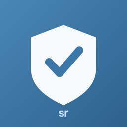

# PhySec Audit

Physical security audit tool by  **sadrobot**.

85 physical security requirements in 10 domains, mapped to **ISO 27001** clauses, **ISO 27002 / Annex A** controls, **NIST SP 800-53 r5** and **ASIS PAP-2021**. At the end of every audit the app creates a PDF report and an Excel workbook that you can save on your own device.

**Web app (PWA):** https://krisztianhari-wq.github.io/Physical-Security-Audit-Tool/

**Installers (macOS, Windows, Android):** [Releases](https://github.com/krisztianhari-wq/Physical-Security-Audit-Tool/releases)

## Features

- **Multiple audits:** audit list with search and a status filter (in progress / closed). Every audit is kept, so earlier results can be reviewed at any time.
- **Requirements:** per requirement you record a status (compliant, partial, non-compliant, not applicable), an owner and the evidence / findings. The app records who changed what, and when.
- **Control map:** tiles for the four frameworks, coloured by the worst status of the mapped requirements. Selecting a tile filters the requirement list.
- **Summary:** KPIs, per-domain breakdown, findings (most severe first), audit details and recent activity.
- **Closing an audit** creates the reports:
  - **PDF report** (A4 landscape): a summary page with KPIs, domain breakdown and findings, followed by every requirement in a table.
  - **Excel workbook** with two sheets: *Assessment* (all 85 requirements with the assessment and the framework mappings) and *Summary* (audit details and totals).
- **Import:** read an Excel or CSV file back with a merge (the newer entry wins; rows edited directly in Excel are taken over).
- **Backup and restore:** all audits in one JSON file, which can be restored on another device.
- **Start page** that explains the tool and the four steps in plain words.
- **Hungarian and English UI**, light and dark mode (follows the system by default, or pick one with the *Theme* button in the header), from phone to desktop.

## Privacy

All data stays **on the device** (the local storage of the browser or the app). There is no server, account, analytics or network traffic. Clearing the browser data also deletes the audits, so make regular backups (*Backup and restore*).

## Platforms

| Platform | How |
|---|---|
| **Web** | Open the link above in any modern browser. Works offline (PWA). |
| **Windows** | `*-setup.exe` or `*.msi` from Releases. SmartScreen: *More info → Run anyway*. |
| **macOS** | `*_universal.dmg`. The app is not signed with an Apple certificate: after dragging it to Applications, run once `xattr -cr "/Applications/PhySec Audit.app"`. |
| **Android** | `*.apk` from Releases (allow installing apps from unknown sources). |
| **iOS / iPadOS** | Safari → the web link → *Share → Add to Home Screen*. An App Store build needs an Apple Developer account; the project also builds for iOS (`npx tauri ios build`). |

Saving reports: a save dialog on desktop, the share sheet on iOS (Files, AirDrop, Mail), the system save dialog on Android, a download in the browser.

## Development

```bash
npm ci
npm run dev          # http://localhost:5173
npm test             # unit tests (catalogue, workbook, import merge, hostile input)
npm run build        # web build → dist/
npx tauri build      # desktop app (Rust toolchain needed)
npx tauri android init && npx tauri android build --apk --target aarch64
npx tauri ios init && npx tauri ios build
```

- `data/requirements.json` – the requirement catalogue (single source of truth).
- `src/` – TypeScript UI without a framework: `store.ts` (audits in localStorage), `xlsx.ts` (library-free .xlsx writer and reader), `report.ts` (PDF via html-to-image + jsPDF), `platform.ts` (saving files on every platform).
- `src-tauri/` – Tauri v2 shell for macOS, Windows, iOS and Android.
- CI: `pages.yml` deploys the PWA on every push to `main`; `release.yml` builds the macOS, Windows and Android installers on `v*` tags.

## License


MIT © 2026 sadrobot
